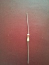
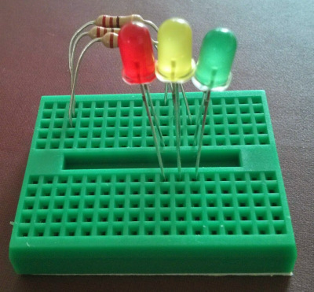
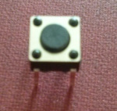

Wire and Flashing Lights
===========================

# Introduction

For this part, we will be using Lights, Switches, Wires and Batteries to create a simple set of traffic lights.

# Components

First of all we'll look at some components. Check you have each component as you read through this sheet.

## Light Emitting Diode

This is a Light Emitting Diode (or LED for short). Similar to a lightbulb, it converts electrical energy into light. There are many differences. It emits light when current passes through it in one direction. In the other direction, it blocks the current and will not light. An LED uses a tiny fraction of the power of a traditional bulb, does not lose lots of energy from heat and can be switched on and off many more times. For these reasons, LEDs are used in all electronics: phones, tablets, Playstations - everything from TV screens to Blackpool Illuminations.

As LEDs need to be placed the right way around in a circuit, their connectors need to be easily identified. One leg is longer than the other. This is the positive leg (or Anode). The shorter leg is the Negative leg (or Cathode).

Each group should have 3 LEDs, one red, one green and one amber/yellow.

Sadly it is easy to destroy an LED compared to a normal bulb. To prevent this, we use something called a resistor.

## Resistors

A resistor is used to *resist* the flow of current (it is usually a coil of wire which heats up, reducing the overall current flow.)

When electrical engineers destroy components by not using resistors, the components often release a small amount of smoke. Electrical engineers like to call this the magic blue smoke which exists in all electronic equipment to make it work!

To prevent the magic blue smoke escaping from our LEDs, we use resistors. These have coloured bands on the outside of them to help us read how much resistance they provide. Today, we are using Red, Red and Brown bands = 2 2 * 10 = 220 Ohms. (and one Gold band indicates how close they are to this value). 

## Jumperlead

A jumperlead connects different rows of a breadboard together.

## Battery

This is a container for batteries. This particular pack contains two AA batteries. Notice that it has a red and black wire. The Red wire is Positive (Anode) and the Black wire is negative (Cathode).

## Breadboard

A breadboard is used to build circuits on.

# Build

First of all, place the 3 resistors onto the breadboard like this picture.

In this image, the Left side of the resistors is in Row 3 and the Right side is in Row 10, 11 and 12.

Next insert the LEDs into Row 10, 11 and 12. The long leg should be on the same side as the Resistors. The short leg should bridge the gap in the breadboard. Note that each LED should be in it's own row.

Add some jumper wires from the ends of the LED back to the other side of the board near to our battery.

Finally, connect up the battery pack to Row 3 and Row 1 where our jumper wires ended up.

If you wish at this point, you can use push button switches to control the LEDs on and off. A Push button switch should be connected diagonally across the pins.

In the picture above, when the button is closed: 

* Top Left pin is connected to Bottom Right pin. 
* Bottom Left pin is connected to Top Right pin.
