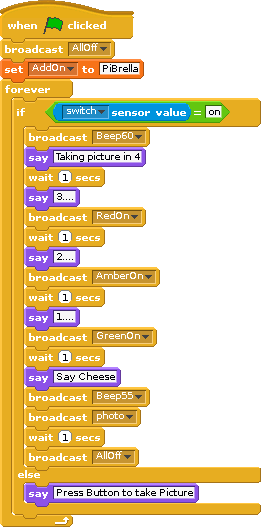

# Using Scratch to control electronics

##
   Introduction to the Raspberry Pi

## Raspberry Pi controlling breadboard LEDs

1. Attach the following pins from the Raspberry Pi to the LEDs on the breadboard. You may need some help with this.

2. Double click on the `Scratch GPIO 5` icon

    

3. Join the blocks together making all LEDs light

    

4. Click the green flag to start the program

## Raspberry Pi and Scratch GPIO reading from Input switches

1. Attach the following pins from the Raspberry Pi to the switches on the breadboard. You may need some help with this.

2. Double click on the `Scratch GPIO 5` icon

    

## Licence

