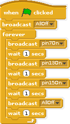

# Using Scratch to control electronics on the Raspberry Pi

It is possible to connect LEDs, Switches and Buzzers directly to the Raspberry Pi. The Raspberry Pi can then be programmed to switch these on and off using a language called Scratch. 

## Raspberry Pi controlling breadboard LEDs

1. Attach the following pins from the Raspberry Pi to the LEDs on the breadboard. To do this, it is easiest to use Male to Female Jumper Jerky. You may need some help connecting up the right pins. Be careful and double check before connecting to the Pi. If you are unsure, ask the teacher to check the circuit.

   

Traffic light Fritzing diagram taken with permission from http://4tronix.co.uk/blog/?p=219

2. Double click on the `Scratch GPIO 5` icon

    

3. Join the blocks together making all LEDs light in turn

    

4. Click the green flag to start the program

## Raspberry Pi and Scratch GPIO reading from Input switches

1. Attach the following pins from the Raspberry Pi to the switches on the breadboard. You may need some help with this.

2. Double click on the `Scratch GPIO 5` icon

    

## Licence
Traffic light Fritzing diagram taken from http://4tronix.co.uk/blog/?p=219

