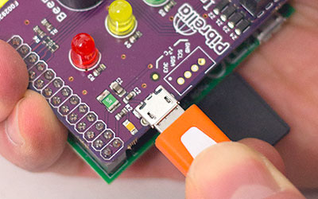
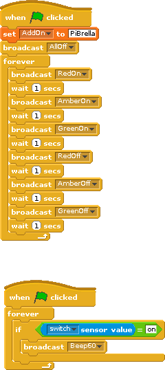

# Using a PiBrella and Scratch

##
   Introduction to the Raspberry Pi

## Connect the Pibrella board to the Raspberry Pi

1. Attach the Pibrella to the Raspberry Pi. You may need some help with this. Power up the Pibrella  and not the Raspberry Pi.

    

2. Double click on the `Scratch GPIO 5` icon

    

3. Join the blocks together making your photo booth

    

## Licence

